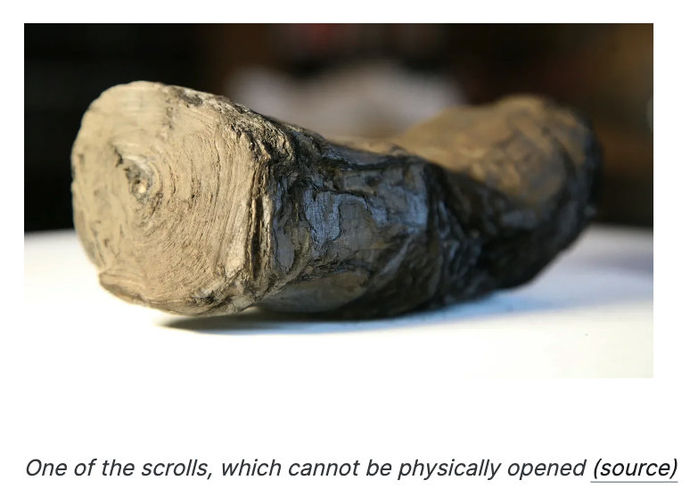

# Kaggle Competition - Ink Detection

## Goal of Competition

Join the $1,000,000+ [Vesuvius Challenge](https://scrollprize.org/) to resurrect an ancient library from the ashes of a volcano. In this competition you are tasked with detecting ink from 3D X-ray scans and reading the contents. Thousands of scrolls were part of a library located in a Roman villa in Herculaneum, a town next to Pompeii. This villa was buried by the Vesuvius eruption nearly 2000 years ago. Due to the heat of the volcano, the scrolls were carbonized, and are now impossible to open without breaking them. These scrolls were discovered a few hundred years ago and have been waiting to be read using modern techniques.

The ink used in the Herculaneum scrolls does not show up readily in X-ray scans. But we have found that machine learning models can detect it. Luckily, we have ground truth data. Since the discovery of the Herculaneum Papyri almost 300 years ago, people have tried opening them, often with disastrous results. Many scrolls were destroyed in this process, but ink can be seen on some broken-off fragments, especially under infrared light.

## Data

The dataset contains 3d x-ray scans of four such fragments at 4µm resolution, made using a particle accelerator, as well as infrared photographs of the surface of the fragments showing visible ink. These photographs have been aligned with the x-ray scans. We also provide hand-labeled binary masks indicating the presence of ink in the photographs.该数据集包含使用粒子加速器以 4μm 分辨率对四个此类碎片进行的 3D X 射线扫描，以及显示可见墨水的碎片表面的红外照片。这些照片已与 X 射线扫描结果对齐。我们还提供手工标记的二元蒙版，指示照片中是否存在墨水。

## My Learning Notes

[Note](https://tana.pub/GRFrqR79P8/ink-detection) published by Tana Public
